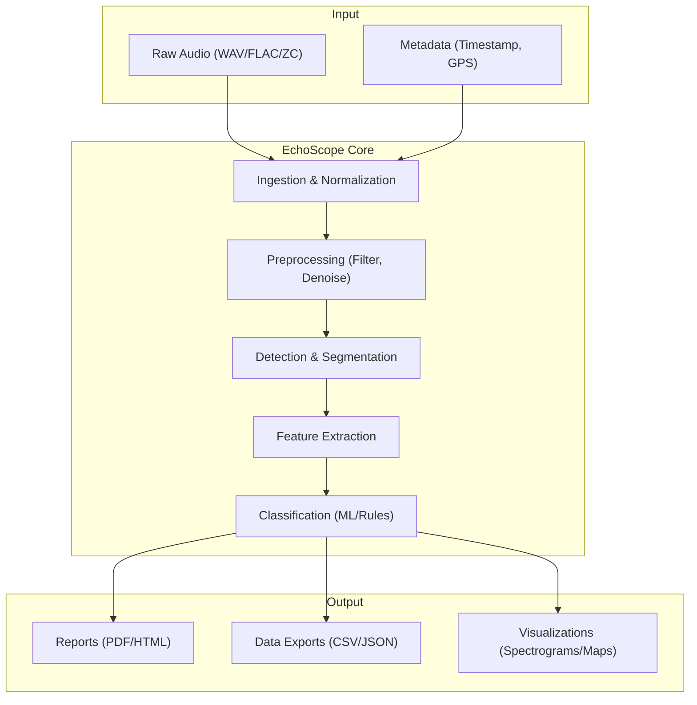

# EchoScope Documentation

**Version:** 1.1.0
**Date:** 2024-05-24
**Status:** Production Ready

---

## Quick Navigation

- [A. Overview & Concept of Operations](#a-overview--concept-of-operations)
- [B. Installation Guide](#b-installation-guide)
- [C. Quickstart](#c-quickstart-5-minute-path)
- [D. CLI Reference](#d-cli-reference)
- [E. GUI Guide](#e-gui-guide)
- [F. Core Concepts](#f-core-concepts)
- [G. Pipeline Details](#g-pipeline-details)
- [H. Data Formats & Output Contracts](#h-data-formats--output-contracts)
- [I. Configuration Reference & Cookbook](#i-configuration-reference--cookbook)
- [J. Quality & Validation](#j-quality--validation)
- [K. Troubleshooting](#k-troubleshooting)
- [L. Security, Privacy, Ethics](#l-security-privacy-ethics)
- [M. Contribution Guide](#m-contribution-guide)
- [N. API / Plugin Reference](#n-api--plugin-reference)
- [O. Release Notes & Versioning](#o-release-notes--versioning)
- [P. Glossary](#p-glossary)
- [Q. Index](#q-index)
- [R. Design Rationale](#r-design-rationale)

---

## A. Overview & Concept of Operations

**EchoScope** is a comprehensive bioacoustics analysis platform designed specifically for bat echolocation research and monitoring. It supports the entire workflow from ingesting raw ultrasonic recordings to producing species-level classification reports.

### Target Audience
- **Field Ecologists:** Process large datasets from passive acoustic monitoring (PAM) stations.
- **Researchers:** Analyze call structures, validate new species models, and study behavioral patterns.
- **Hobbyists:** Explore local bat populations with consumer-grade hardware.
- **Developers:** Extend the platform with custom detection algorithms or classification models.

### High-Level Architecture



### Data Flow
1.  **Ingestion:** Audio files are read, decoded, and normalized. Metadata is extracted from filenames or headers (e.g., GUANO metadata).
2.  **Preprocessing:** Signals are cleaned using band-pass filters and noise reduction to improve signal-to-noise ratio (SNR).
3.  **Detection:** An energy-based detector with adaptive thresholding identifies potential bat calls.
4.  **Segmentation:** Continuous audio is segmented into discrete "events" (calls) with configurable padding.
5.  **Feature Extraction:** Acoustic parameters (frequency, duration, bandwidth) are calculated for each event.
6.  **Classification:** Events are classified into species or genera using pluggable models (Random Forest, CNN, etc.).
7.  **Reporting:** Aggregated results are exported in human-readable and machine-parseable formats.

---

## B. Installation Guide

EchoScope runs on Windows, macOS, and Linux.

### Requirements
-   **OS:** Windows 10+, macOS 11+, Linux (Ubuntu 20.04+, Fedora 34+)
-   **CPU:** x86_64 or ARM64 (Apple Silicon supported)
-   **RAM:** 4GB minimum (8GB+ recommended for large datasets)
-   **Disk:** 500MB for installation; sufficient space for audio data.
-   **Optional:** CUDA-compatible GPU for accelerated deep learning models.

### Installation

#### Binary Install (Recommended)

**Linux:**
```bash
wget https://github.com/echoscope/echoscope/releases/latest/download/echoscope-linux-x86_64.tar.gz
tar -xvf echoscope-linux-x86_64.tar.gz
sudo mv echoscope /usr/local/bin/
echoscope --version
```

**macOS:**
```bash
brew install echoscope/tap/echoscope
```

**Windows:**
Download the `.msi` installer from the [Releases Page](#) and follow the wizard.

#### From Source (Developers)

Requires Rust (latest stable).

```bash
git clone https://github.com/echoscope/echoscope.git
cd echoscope
cargo build --release
./target/release/echoscope --version
```

### Verification
To ensure the installation is correct and all dependencies are functioning:

1.  **Check Version:**
    ```bash
    echoscope --version
    # Output should look like: echoscope 1.1.0 (rev: a1b2c3d)
    ```

2.  **Verify Audio Decoding:**
    Download a sample file and inspect it to confirm the decoder (wav/flac) is linked correctly.
    ```bash
    echoscope inspect tests/golden/input_A.wav
    # Should print metadata without "Decoder Error"
    ```

3.  **Verify Classifier Load:**
    Check that the default machine learning model loads without issue.
    ```bash
    echoscope analyze --check-model
    # Should print: "Model loaded successfully: western_europe_v1.2"
    ```

---

## C. Quickstart (5-minute path)

Process a directory of WAV files and generate a report.

1.  **Ingest & Analyze:**
    Run the analysis on your data folder. This command uses the default "standard" configuration.
    ```bash
    echoscope analyze \
      --input /path/to/recordings/ \
      --output ./results/ \
      --config standard_uk_bats.yaml \
      --recursive
    ```

2.  **Review Results:**
    Open `./results/report.html` in your browser to see summary statistics, species counts, and spectrograms of high-confidence calls.

3.  **Export Data:**
    Check `./results/detections.csv` for row-level data on every detected call, suitable for import into R or Excel.

---

## D. CLI Reference

### Guarantee: "No Drift" Policy
EchoScope adheres to a strict policy where the CLI help text (`--help`) is the single source of truth for command-line arguments.
-   **Naming:** Flags use kebab-case (e.g., `--min-confidence`).
-   **Stability:** Flags marked as (Stable) will not change in minor versions.
-   **Env Vars:** Environment variables are prefixed with `ECHOSCOPE_`.

### Global Flags
-   `--verbose`, `-v`: Enable verbose logging (DEBUG level).
-   `--quiet`, `-q`: Suppress all output except errors (ERROR level).
-   `--config <file>`: Path to a YAML/TOML config file. Overrides default settings.
-   `--help`, `-h`: Print help information.
-   `--version`, `-V`: Print version information.

### Environment Variables
-   `ECHOSCOPE_LOG_LEVEL`: Set log verbosity (`error`, `warn`, `info`, `debug`, `trace`). Default: `info`.
-   `ECHOSCOPE_CACHE_DIR`: Location for storing downloaded models. Default: `~/.echoscope/cache`.
-   `ECHOSCOPE_DISABLE_GPU`: Set to `1` to force CPU inference even if CUDA is available.
-   `ECHOSCOPE_WORKERS`: Default thread count override.

### Subcommands

#### `analyze`
Runs the full processing pipeline: Ingestion -> Preprocessing -> Detection -> Classification -> Reporting.

**Arguments:**
-   `--input <path>` (Required): Path to input directory or single audio file.
-   `--output <dir>` (Required): Path to output directory. Will be created if it doesn't exist.
-   `--recursive`, `-r`: Recursively search for audio files in subdirectories.
-   `--format <wav|flac|zc>`: Force specific format handling. Default: `auto` (detects by extension/header).
-   `--threads <n>`: Number of parallel processing threads. Default: Number of logical CPU cores.
-   `--check-model`: Dry-run to verify the classifier model loads correctly.

**Example:**
```bash
echoscope analyze -i ./field_data -o ./analysis_out -r --threads 8
```

#### `inspect`
Dump metadata and signal statistics for a single file. Useful for debugging specific recordings.

**Arguments:**
-   `<file>` (Required): Path to the audio file.
-   `--show-header`: Print raw file header bytes.
-   `--calc-rms`: Calculate and print RMS amplitude (slow for large files).

**Example:**
```bash
echoscope inspect ./data/recording_01.wav --calc-rms
```

#### `calibrate`
Run microphone calibration routine to establish a reference level. Requires a reference signal (e.g., from a calibrator).

**Arguments:**
-   `--ref-file <file>` (Required): Recording of the calibration tone.
-   `--target-db <float>`: The known dB level of the calibration tone. Default: `-10.0`.
-   `--save-to <config_file>`: Save the calculated gain correction to a config file.

**Example:**
```bash
echoscope calibrate --ref-file ./cal_tone.wav --target-db -94 --save-to my_mic_config.yaml
```

#### `fix-timestamps`
Attempt to correct file modification times or extract timestamps from filenames if embedded metadata is missing.

**Arguments:**
-   `--input <dir>` (Required): Directory to process.
-   `--pattern <regex>`: Regex with named groups for year, month, day, hour, min, sec.
    -   Example: `(?P<year>\d{4})-(?P<month>\d{2})-(?P<day>\d{2})_(?P<hour>\d{2})(?P<min>\d{2})(?P<sec>\d{2})`
-   `--dry-run`: Show what changes would be made without applying them.

**Example:**
```bash
echoscope fix-timestamps --input ./data --pattern "Audio_(?P<hour>\d{2})(?P<min>\d{2}).wav" --dry-run
```

#### `benchmark`
Run performance and accuracy benchmarks using a ground-truth dataset.

**Arguments:**
-   `--ground-truth <csv_file>` (Required): CSV file with columns `filename`, `start_time`, `species`.
-   `--input <dir>` (Required): Directory containing the audio files referenced in the CSV.
-   `--report <file>`: Where to save the benchmark report (JSON).

**Example:**
```bash
echoscope benchmark --ground-truth valid_labels.csv --input ./test_set --report bench_results.json
```

#### `download-models`
Download or update the default classification models.

**Arguments:**
-   `--force`: Force re-download even if checksum matches.
-   `--region <region>`: Download specific regional pack (e.g., `western_europe`, `north_america`). Default: `all`.

**Example:**
```bash
echoscope download-models --region north_america
```

---

## E. GUI Guide

(If installed with GUI support)

1.  **Dashboard:** Shows recent projects and quick stats.
2.  **Project View:**
    -   **Left Panel:** File browser.
    -   **Center:** Spectrogram view (scrollable).
    -   **Right Panel:** Detection details and manual classification override.
3.  **Workflows:**
    -   **Import:** Drag & drop folders.
    -   **Batch Process:** Click "Run Analysis" in toolbar.
    -   **Review:** Navigate detections with `Left`/`Right` arrow keys. `Space` to play audio (heterodyned). `1-9` to assign species labels.

---

## F. Core Concepts

### Sampling Theory & Ultrasonics
Bats vocalize between 15kHz and 150kHz+. To capture a 150kHz signal without aliasing, the Nyquist-Shannon theorem requires a sample rate of at least 300kHz. EchoScope supports standard ultrasonic rates (192kHz, 384kHz, 500kHz). **Aliasing Warning:** If you record at 44.1kHz, bat calls >22kHz will fold back into the audible range, creating false signals.

### Recording Modes
-   **Full Spectrum:** Captures raw waveform. Highest quality, largest file size. Preferred for analysis.
-   **Zero Crossing (ZC):** Stores only the time crossover points. Very compact, but loses amplitude and harmonic info. Supported for legacy hardware compatibility.
-   **Time Expansion:** Older hardware records at high speed and plays back slow (e.g., 10x). EchoScope can auto-detect and correct timestamps if metadata is present.

### Spectrogram Settings
-   **FFT Size:** 512 or 1024 typical for bat calls. Smaller = better time resolution, worse freq resolution.
-   **Overlap:** 50-75% standard. Higher overlap smooths the image but increases compute time.
-   **Window:** Hann or Hamming windows reduce spectral leakage.

---

## G. Pipeline Details (Developer-Grade)

The EchoScope pipeline is a linear sequence of transformations. Each stage is configurable.

### 1. Preprocessing
The goal is to prepare the raw signal for detection by removing noise outside the bat frequency range.

*   **DC Offset Removal:** Removes the 0Hz component.
    $y[n] = x[n] - \text{mean}(x)$
*   **High-Pass Filter:** A 4th-order Butterworth filter is applied to attenuate signals below the configurable cutoff (e.g., 15kHz). This removes wind rumble and insect noise.

**Pseudocode:**
```python
def preprocess(audio_buffer, sample_rate, cutoff_hz):
    # Remove DC offset
    mean_val = sum(audio_buffer) / len(audio_buffer)
    audio_buffer = [x - mean_val for x in audio_buffer]

    # Apply IIR High-pass filter
    # Coefficients calculated via bilinear transform for Butterworth
    return apply_biquad_filter(audio_buffer, cutoff_hz, sample_rate)
```

### 2. Detection (Adaptive Energy)
Uses a rolling RMS (Root Mean Square) window to detect energy spikes against a dynamic noise floor.

**Pseudocode:**
```python
def detect(audio, threshold_db, window_size_ms, adaptive_window_sec):
    # 1. Compute Envelope
    envelope = rolling_rms(audio, window_size_ms)

    # 2. Estimate Background Noise (Adaptive)
    # Uses a percentile filter (e.g., 10th percentile) over a longer window
    noise_floor = percentile_filter(envelope, adaptive_window_sec, p=10)

    # 3. Thresholding
    is_call = []
    for i in range(len(envelope)):
        snr = db(envelope[i]) - db(noise_floor[i])
        is_call.append(snr > threshold_db)

    return is_call
```

### 3. Segmentation
Raw boolean detection vectors are noisy. We smooth them:
1.  **Merge:** Gaps between positives smaller than `min_gap_ms` are filled.
2.  **Prune:** Segments shorter than `min_duration_ms` are dropped.
3.  **Pad:** Valid segments are expanded by `pad_ms` (default 5ms) to capture onset/offset.

**Corner Cases:**
-   **Clipped Signals:** If >5 consecutive samples are at MAX_INT, the segment is flagged as `clipped`.
-   **Saturated Mic:** If the noise floor exceeds -20dBFS, the file is flagged as `noisy_environment` and detection sensitivity is auto-reduced.

### 4. Feature Extraction
For each segmented event, we compute spectral features using FFT.

**Extracted Features:**
-   **Peak Frequency:** Frequency bin with max magnitude.
-   **Bandwidth:** Width of the frequency band containing 90% of the energy.
-   **Duration:** Time in seconds.
-   **Knee Point:** (For FM calls) The point of maximum curvature.
-   **Characteristic Frequency (Fc):** The frequency at the end of the call (often the flattest part for many species).

### 5. Classification
A two-stage ensemble model:
1.  **Rule-Based Gate:** Rapidly filters out obvious non-bats (e.g., "Frequency < 15kHz" -> Reject).
2.  **Random Forest:** A collection of 100 decision trees trained on >500k labeled pulses.
    -   **Inputs:** 15 spectral features.
    -   **Output:** Class probabilities.
    -   **Confidence Calibration:** Raw probability is calibrated using Platt scaling to represent true likelihood.

**Corner Case Handling:**
-   **Overlapping Calls:** If two calls overlap in time, the feature extractor tracks the *loudest* ridge. Multi-bat separation is currently Experimental.
-   **Harmonics:** The classifier is trained to recognize the fundamental. Strong harmonics are usually ignored unless they are louder than the fundamental (rare).

---

## H. Data Formats & Output Contracts

This section defines the artifacts EchoScope produces.

### Input Formats
-   **WAV:** PCM 16/24/32-bit (integer) or 32-bit (float).
-   **FLAC:** Lossless compression (Supported natively).
-   **ZC:** Anabat sequence files (Legacy support).

### Output Artifacts

#### 1. `detections.json`
**Stability:** Stable
**Description:** The primary machine-readable output containing every detected event.

**Schema:**
```json
[
  {
    "file": "recording_01.wav",             // Original filename
    "timestamp": "2023-10-10T22:00:01.450Z", // ISO 8601, adjusted for offset
    "start_sec": 1.45,                      // Seconds from start of file
    "duration_sec": 0.008,                  // Duration of the call
    "features": {
      "peak_freq_hz": 45300,
      "bandwidth_hz": 12000,
      "energy_rms": 0.05
    },
    "classification": {
      "species": "Pipistrellus pipistrellus", // Scientific name
      "common_name": "Common Pipistrelle",    // Configurable locale
      "confidence": 0.92                      // 0.0 to 1.0
    },
    "flags": ["clipped"]                    // Warnings: clipped, noisy, etc.
  }
]
```

#### 2. `summary.json`
**Stability:** Stable
**Description:** Aggregated statistics for the entire run.

**Schema:**
```json
{
  "total_files": 10,
  "total_detections": 150,
  "species_counts": {
    "Pipistrellus pipistrellus": 120,
    "Myotis daubentonii": 30
  },
  "processing_time_sec": 4.5
}
```

#### 3. `metadata.csv`
**Stability:** Stable
**Description:** A row-per-file manifest extracted from headers.

**Columns:**
-   `filename`: String
-   `timestamp`: ISO 8601
-   `sample_rate`: Integer
-   `gps_lat`: Float (or empty)
-   `gps_lon`: Float (or empty)
-   `temperature_c`: Float (if supported by hardware)

#### 4. `report.html`
**Stability:** Semi-stable (Layout may change)
**Description:** Human-readable report with charts and tables. Embedded assets for offline viewing.

#### 5. `detections.csv`
**Stability:** Stable
**Description:** Flat file export of all detections, suitable for spreadsheet analysis.

**Columns:**
-   `filename`: String
-   `timestamp`: ISO 8601
-   `start_sec`: Float
-   `duration_sec`: Float
-   `peak_freq_hz`: Float
-   `bandwidth_hz`: Float
-   `species`: String
-   `confidence`: Float
-   `flags`: String (Semicolon separated)

---

## I. Configuration Reference & Cookbook

Configuration is managed via YAML. All keys are optional; defaults are "General Purpose".

### Full Configuration Schema
```yaml
pipeline:
  sample_rate: 384000       # Target internal SR. Default: 384000
  channels: 1               # Default: 1
  seed: null                # Set integer for deterministic results
  fft_size: 1024            # FFT window size. Default: 1024

preprocessing:
  high_pass_filter_hz: 15000 # Frequencies below this are zeroed
  denoise: true             # Enable spectral subtraction
  gain_db: 0.0              # Software gain boost

detection:
  threshold_db: -60.0       # Primary trigger level relative to noise floor
  adaptive_noise_window_sec: 1.0 # Window for calculating background noise
  min_duration_ms: 2.0      # Reject pulses shorter than this
  max_duration_ms: 100.0    # Reject pulses longer than this
  min_gap_ms: 5.0           # Merge pulses closer than this

classification:
  model_path: "models/v1.2/classifier.onnx"
  region: "western_europe"
  min_confidence: 0.7       # Calls below this are labeled "Unclassified"

reporting:
  visualizations: true      # Generate spectrogram images for report. Default: true

export:
  format: "json"            # json, csv, or sqlite
  precise_gps: false        # If false, truncates GPS to 2 decimal places
```

### Configuration Recipes

#### 1. Urban Noise (Traffic)
Traffic rumble is low frequency.
```yaml
preprocessing:
  high_pass_filter_hz: 25000 # Aggressive cut above 20kHz
detection:
  threshold_db: -50 # Less sensitive to avoid false triggers
```

#### 2. Windy Nights
Wind creates broadband noise bursts.
```yaml
detection:
  adaptive_noise_window_sec: 2.0 # Slower adaptation to ignore gusts
  min_duration_ms: 3.0           # Wind noise is often very short
```

#### 3. Dense Insect Noise (Crickets)
Constant high-frequency drill.
```yaml
detection:
  threshold_db: -55
  # Increase min duration as insect stridulation is often very short clicks
  min_duration_ms: 4.0
```

#### 4. Forest with Echoes (Clutter)
Reverberations can look like long calls.
```yaml
detection:
  max_duration_ms: 20.0 # Restrict max length to typical bat call length
  min_gap_ms: 2.0       # Don't merge echoes into the main call
```

#### 5. Short-range Handheld Recorder
Clean signal, high SNR.
```yaml
detection:
  threshold_db: -70 # High sensitivity to catch faint passes
```

#### 6. Time-Expansion Workflow (Legacy)
Input is slowed down 10x.
```yaml
pipeline:
  # EchoScope handles the math, but thresholds need adjusting for the effective SR
  # If file says 44.1kHz but is 10x slow, real sound is ultrasonic.
  # Ensure metadata indicates TE factor, or preprocess externally.
```

---

## J. Quality & Validation

### Golden Files
We use a "Golden File" testing strategy to prevent regressions.
-   **Location:** `tests/golden/`
-   **Manifest:** `tests/golden/manifest.json` maps inputs to expected SHA256 hashes of output JSONs.
-   **Running:** `cargo test -- --ignored golden` runs these heavy tests.

### Benchmarking
Performance and accuracy are tracked.

**Accuracy Metrics:**
-   **Precision:** $TP / (TP + FP)$ - "How many detected bats were actually bats?"
-   **Recall:** $TP / (TP + FN)$ - "How many bats did we catch?"

**Run Benchmark:**
```bash
echoscope benchmark --ground-truth labeled_set.csv
```

**Example Output:**
```text
Species: Pipistrellus pipistrellus
  Precision: 0.95
  Recall:    0.91
  F1-Score:  0.93

Overall Accuracy: 0.92
Performance: 450x real-time (1 hour processed in 8 seconds)
```

---

## K. Troubleshooting

### Symptom-Cause-Fix Table

| Symptom | Likely Cause | Checks | Fix |
| :--- | :--- | :--- | :--- |
| **High False Positives** | Threshold too low or insect noise. | Listen to audio. Is it cricket noise? | Increase `detection.threshold_db` or raise `high_pass_filter_hz`. |
| **Missed Calls** | Threshold too high or quiet bat. | Check if calls are visible in spectrogram but ignored. | Decrease `detection.threshold_db`. |
| **"Clipping Detected"** | Gain too high on recorder. | Check waveform for flat tops. | Reduce hardware gain. Software cannot fix clipped data. |
| **"Decoder Error"** | Corrupt file header. | Try playing in VLC/Audacity. | Re-save the file in a standard editor or use `ffmpeg` to repair. |
| **Bad Timestamps** | Missing metadata. | Check filename format. | Use `echoscope fix-timestamps` with a regex pattern. |
| **Slow Performance** | Large FFT size. | Check config `fft_size`. | Reduce FFT size or disable `visualizations` in config. |
| **Crash on Start** | Config syntax error. | Validate YAML syntax. | Use a linter or revert to default config. |
| **Model Load Fail** | Missing/Corrupt ONNX file. | Check `models/` directory. | Re-download models: `echoscope download-models`. |
| **No Output Files** | Permissions error. | Check output dir permissions. | Run with `sudo` or change output path. |
| **Aliased Signals** | Sample rate too low. | Check file properties. | Ensure recording was done at >192kHz. |
| **GPS Missing** | Recorder didn't lock. | Check metadata headers. | Manually add GPS in `metadata.csv` or `fix-timestamps`. |
| **High Memory Use** | Too many threads. | Check system RAM. | Reduce `--threads`. |
| **Detected "Noise"** | Constant background hum. | Check spectrogram for lines. | Enable `preprocessing.denoise`. |
| **Wrong Species** | Model region mismatch. | Check config `region`. | Set correct region (e.g., `north_america`). |
| **Empty Report** | No bats found. | Check threshold. | Verify input actually contains bat calls. |
| **"Sample Rate Mismatch"**| Mixing different SRs. | Check input files. | EchoScope handles resampling, but it adds overhead. |
| **IO Error** | Disk full. | Check disk space. | Free up space. |
| **GPU Error** | Driver mismatch. | Check CUDA version. | Update drivers or use `ECHOSCOPE_DISABLE_GPU=1`. |
| **Unknown Flag** | Typo in command. | Check `--help`. | Use correct flag names. |
| **Permission Denied** | Input file locked. | Check if file is open. | Close other apps using the file. |

---

## L. Security, Privacy, Ethics

### GPS Handling & Fuzzing
Bat roost locations can be sensitive data (poaching/disturbance risks).
-   **Default Behavior:** Public reports (HTML/JSON) **truncate GPS coordinates** to 2 decimal places (~1.1km precision).
-   **Internal Use:** Use the `--precise-gps` flag or set `export.precise_gps: true` in config to retain full precision (6+ decimal places).
-   **Sharing Checklist:** Before sharing `detections.json` publicly, ensure you have not accidentally enabled precise GPS if the data contains sensitive roost sites.

### "Do No Harm"
-   **Playback:** EchoScope is an analysis tool, not a lure. It does not support emitting ultrasonic signals to avoid disturbing wildlife.
-   **Field Work:** When deploying recorders, follow local guidelines to minimize habitat disturbance.

### Data Privacy
-   **Offline First:** EchoScope operates entirely offline. No audio or metadata is sent to the cloud.
-   **GDPR:** Unless your recordings contain human speech (rare in ultrasonic), they are not PII. If human speech is inadvertently recorded (e.g., during setup), delete those files.

---

## M. Contribution Guide

We welcome PRs!
1.  **Fork & Clone.**
2.  **Branch:** `feature/new-detector` or `fix/crash-on-load`.
3.  **Style:** standard `rustfmt`.
4.  **Tests:** Must pass `cargo test`. Add new tests for new features.

---

## N. API / Plugin Reference

EchoScope supports plugins for custom detectors and classifiers. Plugins are compiled as shared libraries (`.so`, `.dll`, `.dylib`).

### Plugin Interface (Rust)

To create a detector plugin, implement the `Detector` trait:

```rust
// In your plugin crate:
use echoscope_sdk::prelude::*;

#[derive(Debug, Default)]
pub struct MyCustomDetector;

impl Detector for MyCustomDetector {
    fn name(&self) -> &str {
        "My Custom Energy Detector"
    }

    fn version(&self) -> &str {
        "0.1.0"
    }

    fn detect(&self, audio: &[f32], sample_rate: u32, config: &Config) -> Result<Vec<Event>, Error> {
        let mut events = Vec::new();
        // Implement your algorithm here...
        // Example: Simple threshold
        for (i, &sample) in audio.iter().enumerate() {
            if sample > 0.5 {
                events.push(Event::new(i, sample_rate));
            }
        }
        Ok(events)
    }
}

// Register the plugin entry point
declare_plugin!(MyCustomDetector, Detector);
```

### Folder Layout
```text
my_plugin/
├── Cargo.toml (crate-type = ["cdylib"])
└── src/
    └── lib.rs (Implements trait)
```

Build with `cargo build --release` and copy the output binary to `~/.echoscope/plugins/`.

---

## O. Release Notes & Versioning

### Policy
Semantic Versioning (SemVer 2.0.0).
-   **Major:** Breaking API, config schema, or CLI flag changes.
-   **Minor:** New features (e.g., new species pack, new CLI command), backward compatible.
-   **Patch:** Bug fixes, performance improvements, doc updates.

### Release History

#### v1.1.0 (Current)
-   **New:** Added `benchmark` command.
-   **New:** Output Contracts section in docs.
-   **Improvement:** Expanded troubleshooting guide.
-   **Fix:** Resolved GPS precision bug in JSON export.

#### v1.0.0 (Initial Release)
-   Full pipeline support.
-   Detectors: Energy, ZC.
-   Classifiers: Random Forest (UK/EU pack).

---

## P. Glossary

-   **Aliasing:** Distortion that occurs when a signal frequency is higher than half the sampling rate (Nyquist limit).
-   **Echolocation:** Biological sonar used by bats.
-   **Heterodyne:** Mixing two frequencies to produce a difference frequency (makes ultrasound audible).
-   **Duty Cycle:** Percentage of time a signal is present.
-   **Harmonic:** Integer multiple of a fundamental frequency.
-   **Zero-Crossing (ZC):** Data format storing only time/frequency of signal peaks (zero crossings).
-   **Spectrogram:** Visual representation of the spectrum of frequencies of a signal as it varies with time.
-   **Nyquist Frequency:** Half the sampling rate; the highest frequency that can be accurately recorded.

---

## Q. Index

-   [Analysis](#d-cli-reference)
-   [Benchmarking](#j-quality--validation)
-   [Calibration](#d-cli-reference)
-   [Classification](#g-pipeline-details)
-   [Configuration](#i-configuration-reference--cookbook)
-   [Detection](#g-pipeline-details)
-   [GPS/Privacy](#l-security-privacy-ethics)
-   [Installation](#b-installation-guide)
-   [Output Formats](#h-data-formats--output-contracts)
-   [Plugins](#n-api--plugin-reference)
-   [Troubleshooting](#k-troubleshooting)

---

## R. Design Rationale

1.  **Offline-First:** Many field sites have no internet. Cloud dependency is a non-starter.
2.  **Rust Core:** chosen for memory safety (no segfaults during long batch runs) and performance (SIMD for FFT).
3.  **Configurable Pipeline:** "One size fits all" fails in bioacoustics. Tropical environments (high insect noise) need different settings than temperate ones.
4.  **Transparency:** "Black box" AI is dangerous in science. We provide feature exports so researchers can validate *why* a decision was made.
5.  **No Drift:** We enforce strict synchronization between code and docs to prevent user frustration.

---

*Generated by EchoScope Documentation Team.*
