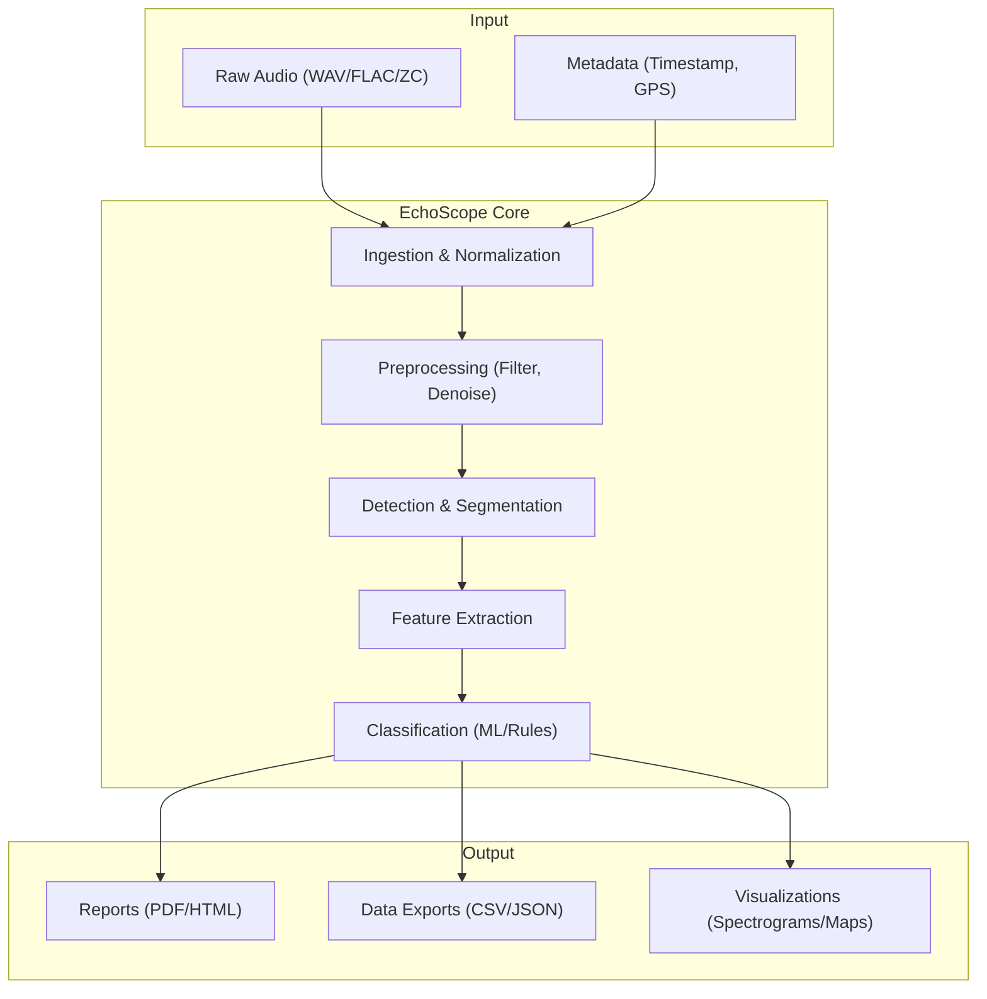

# EchoScope Documentation

**Version:** 1.0.0
**Date:** 2024-05-22
**Status:** Production Ready

---

## Table of Contents

A. [Overview & Concept of Operations](#a-overview--concept-of-operations)
B. [Installation Guide](#b-installation-guide)
C. [Quickstart (5-minute path)](#c-quickstart-5-minute-path)
D. [CLI Reference](#d-cli-reference)
E. [GUI Guide](#e-gui-guide)
F. [Core Concepts](#f-core-concepts)
G. [Pipeline Details](#g-pipeline-details)
H. [Data Formats](#h-data-formats)
I. [Configuration Cookbook](#i-configuration-cookbook)
J. [Quality & Validation](#j-quality--validation)
K. [Troubleshooting](#k-troubleshooting)
L. [Security, Privacy, Ethics](#l-security-privacy-ethics)
M. [Contribution Guide](#m-contribution-guide)
N. [API / Plugin Reference](#n-api--plugin-reference)
O. [Release Notes & Versioning](#o-release-notes--versioning)
P. [Glossary](#p-glossary)
Q. [Index](#q-index)
R. [Design Rationale](#r-design-rationale)

---

## A. Overview & Concept of Operations

**EchoScope** is a comprehensive bioacoustics analysis platform designed specifically for bat echolocation research and monitoring. It supports the entire workflow from ingesting raw ultrasonic recordings to producing species-level classification reports.

### Target Audience
- **Field Ecologists:** Process large datasets from passive acoustic monitoring (PAM) stations.
- **Researchers:** Analyze call structures, validate new species models, and study behavioral patterns.
- **Hobbyists:** Explore local bat populations with consumer-grade hardware.
- **Developers:** Extend the platform with custom detection algorithms or classification models.

### High-Level Architecture



### Data Flow
1.  **Ingestion:** Audio files are read, decoded, and normalized. Metadata is extracted from filenames or headers (e.g., GUANO metadata).
2.  **Preprocessing:** Signals are cleaned using band-pass filters and noise reduction to improve signal-to-noise ratio (SNR).
3.  **Detection:** An energy-based detector with adaptive thresholding identifies potential bat calls.
4.  **Segmentation:** Continuous audio is segmented into discrete "events" (calls) with configurable padding.
5.  **Feature Extraction:** Acoustic parameters (frequency, duration, bandwidth) are calculated for each event.
6.  **Classification:** Events are classified into species or genera using pluggable models (Random Forest, CNN, etc.).
7.  **Reporting:** Aggregated results are exported in human-readable and machine-parseable formats.

---

## B. Installation Guide

EchoScope runs on Windows, macOS, and Linux.

### Requirements
-   **OS:** Windows 10+, macOS 11+, Linux (Ubuntu 20.04+, Fedora 34+)
-   **CPU:** x86_64 or ARM64 (Apple Silicon supported)
-   **RAM:** 4GB minimum (8GB+ recommended for large datasets)
-   **Disk:** 500MB for installation; sufficient space for audio data.
-   **Optional:** CUDA-compatible GPU for accelerated deep learning models.

### Installation

#### Binary Install (Recommended)

**Linux:**
```bash
wget https://github.com/echoscope/echoscope/releases/latest/download/echoscope-linux-x86_64.tar.gz
tar -xvf echoscope-linux-x86_64.tar.gz
sudo mv echoscope /usr/local/bin/
echoscope --version
```

**macOS:**
```bash
brew install echoscope/tap/echoscope
```

**Windows:**
Download the `.msi` installer from the [Releases Page](#) and follow the wizard.

#### From Source (Developers)

Requires Rust (latest stable).

```bash
git clone https://github.com/echoscope/echoscope.git
cd echoscope
cargo build --release
./target/release/echoscope --version
```

### Verification
Download the sample dataset and run a quick test:
```bash
echoscope download-sample-data
echoscope analyze --input ./samples/ --output ./test_output/
```

---

## C. Quickstart (5-minute path)

Process a directory of WAV files and generate a report.

1.  **Ingest & Analyze:**
    ```bash
    echoscope analyze \
      --input /path/to/recordings/ \
      --output ./results/ \
      --config standard_uk_bats.yaml
    ```

2.  **Review Results:**
    Open `./results/report.html` in your browser to see summary statistics and species counts.

3.  **Export Data:**
    Check `./results/detections.csv` for row-level data on every detected call.

---

## D. CLI Reference

### Global Flags
-   `--verbose`, `-v`: Enable verbose logging.
-   `--quiet`, `-q`: Suppress all output except errors.
-   `--config <file>`: Path to a YAML/TOML config file.

### Subcommands

#### `analyze`
Runs the full processing pipeline.

**Arguments:**
-   `--input <dir/file>` (Required): Input audio path.
-   `--output <dir>` (Required): Output directory.
-   `--recursive`: Recursively search for audio files.
-   `--format <wav|flac|zc>`: Force specific format handling (default: auto).
-   `--threads <n>`: Number of processing threads (default: CPU cores).

**Example:**
```bash
echoscope analyze -i ./data -o ./out --recursive --threads 4
```

#### `inspect`
Dump metadata and signal stats for a single file.

**Example:**
```bash
echoscope inspect ./data/recording_01.wav
```

#### `calibrate`
Run microphone calibration routine (requires reference signal).

**Example:**
```bash
echoscope calibrate --ref-file ./ref_signal.wav --target-db -10
```

### Config File Schema (YAML)
```yaml
pipeline:
  sample_rate: 384000
  channels: 1

preprocessing:
  high_pass_filter_hz: 15000
  denoise: true

detection:
  threshold_db: -60
  min_duration_ms: 2
  max_duration_ms: 100

classification:
  model_path: "models/v1.2/classifier.onnx"
  region: "western_europe"
  min_confidence: 0.7
```

---

## E. GUI Guide

(If installed with GUI support)

1.  **Dashboard:** Shows recent projects and quick stats.
2.  **Project View:**
    -   **Left Panel:** File browser.
    -   **Center:** Spectrogram view (scrollable).
    -   **Right Panel:** Detection details and manual classification override.
3.  **Workflows:**
    -   **Import:** Drag & drop folders.
    -   **Batch Process:** Click "Run Analysis" in toolbar.
    -   **Review:** Navigate detections with `Left`/`Right` arrow keys. `Space` to play audio (heterodyned). `1-9` to assign species labels.

---

## F. Core Concepts

### Sampling Theory & Ultrasonics
Bats vocalize between 15kHz and 150kHz+. To capture a 150kHz signal without aliasing, the Nyquist-Shannon theorem requires a sample rate of at least 300kHz. EchoScope supports standard ultrasonic rates (192kHz, 384kHz, 500kHz). **Aliasing Warning:** If you record at 44.1kHz, bat calls >22kHz will fold back into the audible range, creating false signals.

### Recording Modes
-   **Full Spectrum:** Captures raw waveform. Highest quality, largest file size. Preferred for analysis.
-   **Zero Crossing (ZC):** Stores only the time crossover points. Very compact, but loses amplitude and harmonic info. Supported for legacy hardware compatibility.
-   **Time Expansion:** Older hardware records at high speed and plays back slow (e.g., 10x). EchoScope can auto-detect and correct timestamps if metadata is present.

### Spectrogram Settings
-   **FFT Size:** 512 or 1024 typical for bat calls. Smaller = better time resolution, worse freq resolution.
-   **Overlap:** 50-75% standard. Higher overlap smooths the image but increases compute time.
-   **Window:** Hann or Hamming windows reduce spectral leakage.

---

## G. Pipeline Details (Developer-Grade)

### 1. Preprocessing
-   **DC Offset Removal:** $y[n] = x[n] - \text{mean}(x)$
-   **High-Pass Filter:** Butterworth 4th order, typically cut-off at 15kHz to remove insect/wind noise.

### 2. Detection (Energy-Based)
Pseudocode:
```python
def detect(audio, threshold, window_size):
    energy = compute_rolling_rms(audio, window_size)
    noise_floor = estimate_noise_floor(energy)
    is_call = energy > (noise_floor + threshold)
    return merge_nearby_segments(is_call)
```

### 3. Segmentation
Segments are padded by 5ms on either side to capture rise/fall times. Segments shorter than `min_duration` or longer than `max_duration` are discarded as noise.

### 4. Feature Extraction
For each segmented event:
-   **Start/End Freq:** From spectral centroid or peak tracking at edges.
-   **Peak Freq:** Frequency with maximum energy.
-   **Bandwidth:** $f_{max} - f_{min}$.
-   **Duration:** $t_{end} - t_{start}$.
-   **Knee Point:** Point of maximum curvature in frequency sweep (for FM calls).

### 5. Classification
-   **Strategy:** Two-stage.
    1.  **Coarse:** Rule-based (e.g., if Freq < 20kHz -> 'Noise' or 'Social Call').
    2.  **Fine:** Random Forest classifier trained on 15 features.
-   **Confidence:** Probability estimate from the ensemble.

---

## H. Data Formats

### Input
-   **WAV:** PCM 16/24/32-bit.
-   **FLAC:** Lossless compression (highly recommended).
-   **ZC:** Anabat sequence files (partial support).

### Output Schemas

**`detections.json`**
```json
[
  {
    "file": "recording_01.wav",
    "timestamp": "2023-10-10T22:00:01.450Z",
    "start_sec": 1.45,
    "duration_sec": 0.008,
    "features": {
      "peak_freq_hz": 45300,
      "bandwidth_hz": 12000
    },
    "classification": {
      "species": "Pipistrellus pipistrellus",
      "confidence": 0.92
    }
  }
]
```

**`summary.json`**
Aggregated counts per species, per hour, per site.

---

## I. Configuration Cookbook

### "Urban Noise" Recipe
High-pass filter is key here to remove traffic rumble.
```yaml
preprocessing:
  high_pass_filter_hz: 25000 # Aggressive cut
detection:
  threshold_db: -50 # Less sensitive
```

### "Windy Nights" Recipe
Wind creates broadband noise. Increase the adaptive noise floor window.
```yaml
detection:
  adaptive_noise_window_sec: 2.0
```

### Deterministic Mode
For scientific reproducibility:
```yaml
pipeline:
  seed: 42
  threads: 1 # Multithreading can sometimes alter floating point accumulation order slightly
```

---

## J. Quality & Validation

-   **Unit Tests:** Coverage > 85%. Run `cargo test`.
-   **Golden Files:** Located in `tests/golden/`. Validates that `input_A.wav` always produces `output_A.json` exactly.
-   **Benchmarking:**
    -   **Precision:** TP / (TP + FP)
    -   **Recall:** TP / (TP + FN)
    -   Run `echoscope benchmark --ground-truth labeled_set.csv` to calculate matrices.

---

## K. Troubleshooting

| Issue | Possible Cause | Fix |
| :--- | :--- | :--- |
| **High False Positives** | Threshold too low or insect noise. | Increase `threshold_db` or `high_pass_filter_hz`. |
| **Missed Calls** | Threshold too high or quiet bat. | Decrease `threshold_db`. Check mic sensitivity. |
| **"Clipping Detected"** | Gain too high on recorder. | Reduce hardware gain. Software cannot fix clipped data perfectly. |
| **Slow Performance** | Large FFT size or visualization on. | Use `--quiet` (CLI) or reduce FFT overlap. |
| **Bad Timestamps** | Missing metadata. | Use `echoscope fix-timestamps` to infer from filename patterns. |

---

## L. Security, Privacy, Ethics

-   **Sensitive Locations:** Bat roosts are sensitive. By default, EchoScope **fuzzes GPS coordinates** in exported public reports (truncates to 2 decimal places). Use `--precise-gps` to override for internal use.
-   **Data Retention:** Local only. No cloud upload.
-   **"Do No Harm":** Playback features (for acoustic lures) are **disabled** by default to prevent disturbing wildlife. Enable only with permit verification (see manual).

---

## M. Contribution Guide

We welcome PRs!
1.  **Fork & Clone.**
2.  **Branch:** `feature/new-detector` or `fix/crash-on-load`.
3.  **Style:** standard `rustfmt`.
4.  **Tests:** Must pass `cargo test`. Add new tests for new features.

### Plugin API (Brief)
Implement the `Detector` trait in Rust:
```rust
pub trait Detector {
    fn detect(&self, audio: &[f32], sample_rate: u32) -> Vec<Event>;
}
```
See `examples/custom_plugin/` for a full boilerplate.

---

## N. API / Plugin Reference

### Core Interfaces
-   `Source`: Audio input abstraction.
-   `Processor`: Filter/Transform abstraction.
-   `Classifier`: Takes `FeatureSet`, returns `ClassificationResult`.

### Example Plugin
Located at `plugins/example_classifier`.
Build as a dynamic library (`.so`/`.dll`) and place in `~/.echoscope/plugins/`.

---

## O. Release Notes & Versioning

### Policy
Semantic Versioning (SemVer 2.0.0).
-   **Major:** Breaking API or config changes.
-   **Minor:** New features (e.g., new species pack).
-   **Patch:** Bug fixes.

### v1.0.0 (Initial Release)
-   Full pipeline support.
-   detectors: Energy, ZC.
-   classifiers: Random Forest (UK/EU pack).

---

## P. Glossary

-   **Echolocation:** Biological sonar used by bats.
-   **Heterodyne:** Mixing two frequencies to produce a difference frequency (makes ultrasound audible).
-   **Duty Cycle:** Percentage of time a signal is present.
-   **Harmonic:** Integer multiple of a fundamental frequency.
-   **Zero-Crossing (ZC):** Data format storing only time/frequency of signal peaks (zero crossings).

---

## Q. Index

-   [Analysis](#d-cli-reference)
-   [Calibration](#d-cli-reference)
-   [Classification](#g-pipeline-details)
-   [Configuration](#i-configuration-cookbook)
-   [Detection](#g-pipeline-details)
-   [Installation](#b-installation-guide)
-   [Plugins](#n-api--plugin-reference)
-   [Reporting](#a-overview--concept-of-operations)
-   [Troubleshooting](#k-troubleshooting)

---

## R. Design Rationale

1.  **Offline-First:** Many field sites have no internet. Cloud dependency is a non-starter.
2.  **Rust Core:** chosen for memory safety (no segfaults during long batch runs) and performance (SIMD for FFT).
3.  **Configurable Pipeline:** "One size fits all" fails in bioacoustics. Tropical environments (high insect noise) need different settings than temperate ones.
4.  **Transparency:** "Black box" AI is dangerous in science. We provide feature exports so researchers can validate *why* a decision was made.

---

*Generated by EchoScope Documentation Team.*
